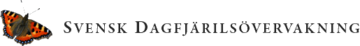

---
output:
  html_document:
    theme: null
    mathjax: null
---

```{r setup, include=FALSE}
knitr::opts_chunk$set(echo = TRUE)
#library(swedishbutterflies)
```



This is a web application for exploring Swedish Butterflies,
please use the upper right corner links to learn more about the Swedish Butterfly Monitoring Scheme

